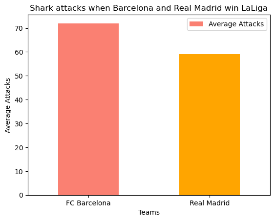
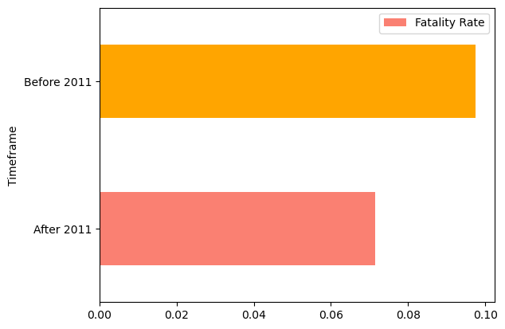
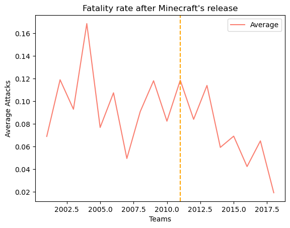
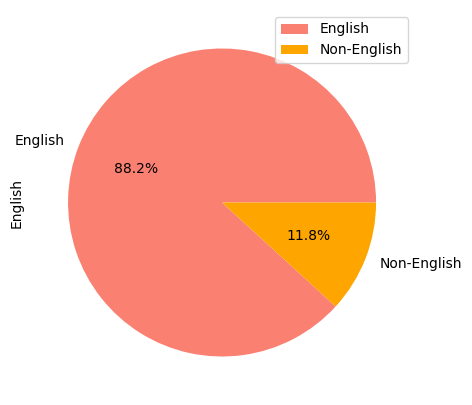

# Project 1 | What Can Data Tell Us About Sharks.
## Project Description
This project consisted on finding "bizarre" statisics on a given database about the reports of all the shark attacks registered worldwide.
 

## Hypotheses:
#### 1. Are sharks culés or merengues?
#### 2. Why should Joe Biden do something
#### 3. How Minecraft has saved many lifes
#### 4. Do sharks hate english-speakers?
 

## Are sharks culés or merengues?

As a big football fan that I am, I wanted to demonstrate to all the merengues out there that sharks, withou any doubt, are supporters for FC Barcelona.

I used Excel to import the historical data on the winners of LaLiga, which I then compared to the number of shark attacks per year. 

We can see that clearly, sharks are culés. We see this through the increase in their excitement everytime that FC Barcelona wins the LaLiga cup. 

This increase in excitement makes the sharks be more nervous and therefore we see that there are, in average, more attacks everytime that Barça wins the Spanish League. Therefore sharks are undoubtly, culés.

## Why should Joe Biden do something

This hypotheses aims to calculate an approximate total amount, in taxes, that sharks have costed to the United States.

This was done using the following variables extracted from the internet, and that were necessary for the calculation of such metric:
* Average income: 59,428$
* Income tax: 22%
* Life expectancy: 77

This metric was calculated by looking for the amount that people who were registered in a fatal shark attack would have paid in case that shark attack would have never happened.

Therefore taking into account the amount of expected years of life left, the average income per US citizen, and the tax paid on that income were used for this matter.

### 52,726,701$ in taxes lost.

We have seen through this exercise how shark attacks have had a massive impact in the US economy. A total amount of 52,726,701$ in taxes have been lost due to shark attacks. 

Although this is an issue that has been occurring since long ago, Joe Biden should be the one to start looking for a solution.

## How Minecraft has saved uncountable lifes

Minecraft was released in 2011, together with its survival mode, where players had to learn how to face the dangers of the jungle, desert and sea in order to stay alive.

I wanted to investigate on the possibility that this survival mode could've had a positive impact on the ability of its players to survive different dangerous situations.

Minecraft was released in 2011. Looking at the data, we can see how the average fatalities from shark attacks have seen an enormous decrease since Mineacraft was released. We also know that Minecraft's survival mode shines for its ability to put players under pressure when looking for ways to survive from many different attacks.

Therefore, it is safe to say that Minecraft has had a positive impact on our self-defense skills against many different dangerous situations, and in this case, shark attacks.

Minecraft has therefore, saved uncountable lifes.

## Do sharks hate english-speakers?

Here I took the five countries with most shark attacks. I then calculated the respective population sizes that speak the English language.

I wanted to find out whether there was a pattern on shark attacks on english-speakers.

Through a search through the internet to find the english-speaking percentages of the five-most attacked countries by sharks, we have seen how these are countries with extremely high english-speaking populations. 

Therefore, it is easy to say that: sharks hate english-speakers, and consequently, you have a higher risk of being attacked if you speak the language.

## Conclusion

If you support FC Barcelona, you are not Joe Biden, you have played Minecraft and you are not understanding this text (you don't speak english), it is my pleasure to inform you that your life will be a little easier. 